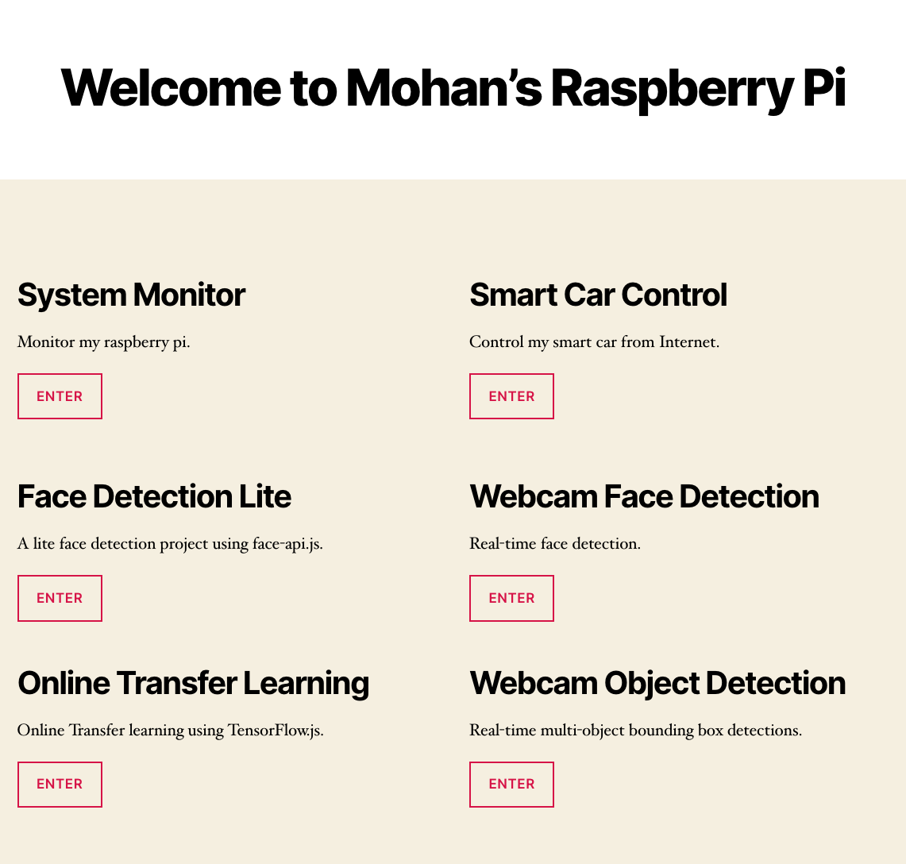

# Pi Home Server Webpage
> This is DIY home server hosted on my raspberry pi 4. A few apps are provides here.

## Available apps and sources
- System monitor: [source1](./html/monitor.php) & [source2](./html/monitor_history.php)
- Smart car control: [source](https://github.com/mohanliu/raspberry-pi-car-module)
- Face Detection Lite: [source](https://github.com/mohanliu/face_detection_lite)
- Webcam face detection: [source](./face_detection_demo)
- Transfer learning online: [source](./html/transferlearning.php)
- Webcam object detection: [source](./html/object-detection.php)
