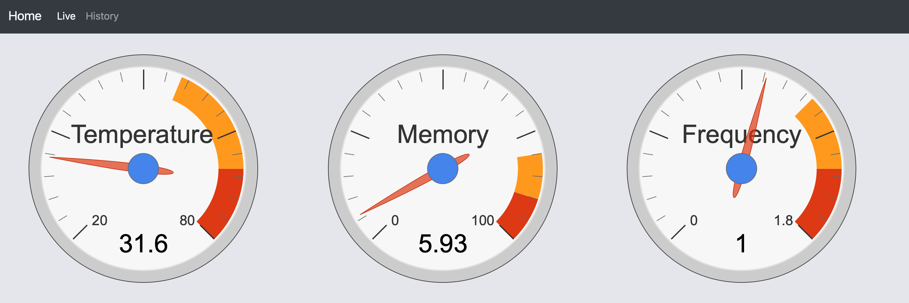
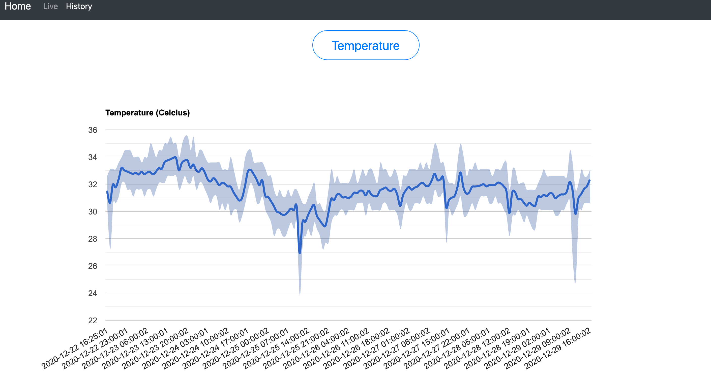
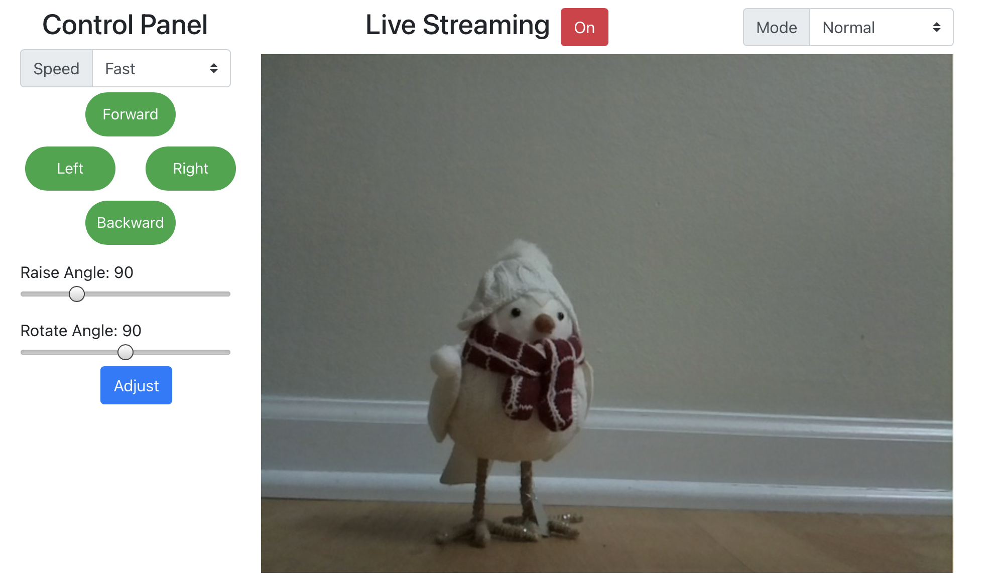
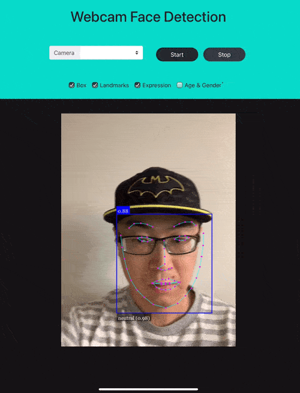

# Documentation

## Table of Contents
1. [System Monitor](#system-monitor)
2. [Smart Car Control](#smart-car-control)
3. [Face Detection Lite](#face-detection-lite)
4. [Webcam Face Detection](#webcam-face-detection)
5. [Online Transfer Learning](#online-transfer-learning)
6. [Webcam Object Detection](#webcam-object-detection)

## System Monitor
> This is an app to monitor some key features of my raspberry pi server.

*Codes: https://github.com/mohanliu/pi-home-server-webpage/blob/main/html/monitor.php*

*Codes: https://github.com/mohanliu/pi-home-server-webpage/blob/main/html/monitor_history.php*

### Features
- Utilized MySQL database to save historical data; set up cron jobs to dump data on every minute
- Using PHP to query data and plot figures using Google Charts
- Live data refreshes every 5 seconds; historical data showing hourly averages

### Future Plans
- Monitor other metrics 
- Improve front-end design

## Smart Car Control
> This is a tool kit to control my smart car equiped with a raspberry pi by itself. 

*Codes: https://github.com/mohanliu/raspberry-pi-car-module*

### Features
- The smart car hosts a server by itself that can be accessed from the same local network.
- Movements of the car can be controled by a web-based app. This app is optimized for both desktop and mobile devices.
- The backend of the app is a flask server. AJAX is used to execute python functions without a POST submission.

## Face Detection Lite
> A face detection app with uploaded images

*Codes: https://github.com/mohanliu/face_detection_lite*

### Features
- Customized from official face-api.js.
- Able to switch between heavy and light models.

## Webcam Face Detection
> A real-time face detection App

*Codes: https://github.com/mohanliu/pi-home-server-webpage/tree/main/face_detection_demo*

### Features
- Optimized for mobile devices which allows both front and back cameras
- Improved front-end design to allow live output feature selection
- Run the app using flask with SSL certificates

## Online Transfer Learning
> A transfer learning web app for realtime image classification

*Codes: https://github.com/mohanliu/pi-home-server-webpage/blob/main/html/transferlearning.php*

### Features
- Using mobilenet model weights as backbone to extract image features; a KNN model as top layer to transfer to a different target task

## Webcam Object Detection
> A real-time multi-instance object detection app

*Codes: https://github.com/mohanliu/pi-home-server-webpage/blob/main/html/object-detection.php*

### Features
- Real-time multi-object inference using tensorflow.js
- Apache 2 server with ssl followed instructions from [here](https://medium.com/@r.robipozzi/have-fun-with-your-raspberry-pi-secure-your-application-with-self-signed-certificates-c8ef455a492f)
